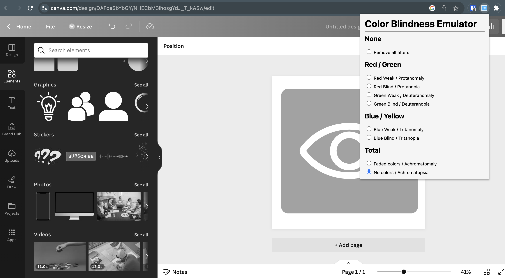

# Color Blindness Emulator Extension / Acknowledgements

This browser extension for Chrome can be used to emulate eight different forms of color blindness. Inspired by Agathe Badia's Talk [here](https://noti.st/agathebadia/DTySgu/accessibility-ember-learning-about-colorblindness#sKc0uBX)

## Installation

Download this repo, then follow the instructions here: [How to load an unpacked extension](https://developer.chrome.com/docs/extensions/mv3/getstarted/development-basics/#load-unpacked)

## Usage

This page works on any non-internal page in Google Chrome. So, it won't work on your "Manage Extensions" screen in Chrome, for example, but it will work on YouTube, Figma, Jira, etc. Simply click the extension and select your filter. The filter is tab-specific and is cleared on page refresh.

## Inspiration

I am passionate about accessibility, and I believe that this extension could help raise awareness of

### Gallery

